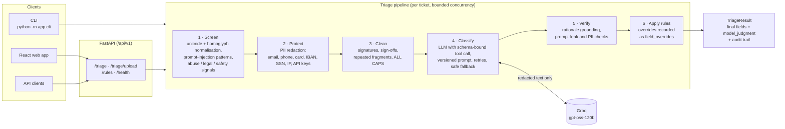

# Support Ticket Triage

An LLM-powered triage service that turns raw support tickets into structured, auditable
decisions: **category, priority, sentiment, customer impact, a human-review flag, and a
rationale grounded in the ticket text**.

The core idea is a strict split between **model judgment** and **deterministic policy**.
The LLM classifies against a fixed schema; rules then check that answer against explicit
evidence in the ticket and may override it. Every override is recorded next to what the
model originally said, so any decision can be explained after the fact.

<!-- Replace the placeholder below with the deployment URL. -->
- **Live app:** https://YOUR-DEPLOYMENT.vercel.app
- **Assessment brief:** [docs/guidelines.md](docs/guidelines.md)
- **Required output (one JSON object per input row):** [data/project_1.triaged.jsonl](data/project_1.triaged.jsonl), a real run over [data/project_1.csv](data/project_1.csv)
- **Evaluation report:** [docs/evaluation.md](docs/evaluation.md)

**Contents:** [Try it](#try-it) · [Results](#results-at-a-glance) ·
[Brief coverage](#how-the-brief-is-covered) · [Engineering practices](#engineering-practices) ·
[Architecture](#architecture) · [Design decisions](#key-design-decisions) ·
[Guardrails](#guardrails) · [Evaluation](#evaluation) ·
[Project structure](#project-structure) · [API](#api) · [Configuration](#configuration)

---

## Try it

Three ways in, all backed by the same pipeline.

### 1. Live app

Open the **[live app](https://YOUR-DEPLOYMENT.vercel.app)**. Nothing to install.

1. **New triage → Try the sample (10 tickets)** runs the assessment CSV through the real
   model (about 10 to 30 seconds).
2. In the run, click any ticket. The panel shows the final decision **next to what the
   model said**, the rule behind every change, the rationale, and every check that ran.
   T006 is a good example: noisy text, cleaned up, and escalated by a rule.
3. **New triage → Write a ticket** classifies a single message. The *Try* links fill in
   examples. Also worth trying: an email address or card number (it is redacted before the
   model sees it), or "ignore previous instructions…" (the model is skipped entirely).
4. **How it works** shows the pipeline and the live rule list served by the API.

The API is available at the same address:

```bash
curl -s https://YOUR-DEPLOYMENT.vercel.app/api/v1/triage \
  -H 'Content-Type: application/json' \
  -d '{"tickets": [{"ticket_id": "T100", "text": "Checkout is failing for all our EU customers."}]}'
```

The deployment runs on Groq's free tier, so a busy minute can hit the provider's rate
limit. Affected tickets come back flagged for review as "Model not used"; they do not fail.

### 2. Command line: the assessment deliverable

Reads a CSV with `ticket_id` and `text` columns and writes **one JSON object per input
row** (JSON Lines), in input order. Requires Python 3.12 and a Groq API key (free at
[console.groq.com/keys](https://console.groq.com/keys)).

```bash
git clone <this repo> && cd ticket-triage
python -m venv .venv
source .venv/bin/activate                  # Windows PowerShell: .venv\Scripts\Activate.ps1
pip install -r requirements.txt            # runtime dependencies only

cp .env.example .env                       # then set GROQ_API_KEY in .env
# or: export GROQ_API_KEY=gsk_...          # Windows PowerShell: $env:GROQ_API_KEY="gsk_..."

cd backend
python -m app.cli ../data/project_1.csv                        # JSON Lines to stdout
python -m app.cli ../data/project_1.csv -o results.jsonl       # to a file
python -m app.cli ../data/project_1.csv --format json          # one JSON array instead
```

- Logs and a one-line summary go to **stderr**, so stdout is always clean JSON Lines.
- Exit code `0` on success; `2` if the file is unreadable or not a ticket CSV.
- Rows with a missing ID or text are still triaged (and flagged); they never fail the file.
- Without `GROQ_API_KEY` the CLI still runs, but every ticket falls back to human review.

The expected result for the sample is committed as
[data/project_1.triaged.jsonl](data/project_1.triaged.jsonl).

### 3. Run the full stack locally

API and web app with hot reload. Requires Python 3.12 and Node 20+.

```bash
cp .env.example .env                       # set GROQ_API_KEY
pip install -r backend/requirements-dev.txt
npm ci --prefix frontend

cd backend && uvicorn app.main:app --reload          # API on :8000, docs at /api/v1/docs
npm run dev --prefix frontend                        # (second terminal) web app on :5173
```

Open http://localhost:5173. The Vite dev server proxies `/api` to the API, exactly like
the production routing. With Docker, `docker compose up --build` starts both.

Development tasks:

| Task | Command |
|---|---|
| Tests with coverage (no network) | `cd backend && pytest --cov=app` |
| Lint, format, strict types | `ruff check app tests evals` · `ruff format --check app tests evals` · `mypy app evals` (in `backend/`) · `npm run lint --prefix frontend` |
| Live evaluation against the model | `cd backend && python -m evals.run_eval` |
| Regenerate the sample output | `cd backend && python -m app.cli ../data/project_1.csv -o ../data/project_1.triaged.jsonl` |

---

## Results at a glance

Live runs of `openai/gpt-oss-120b` via Groq on a 24-case golden set (the 10 assessment
tickets plus 14 adversarial and edge cases), prompt `triage@1.0.0`. Latest report:
[docs/evaluation.md](docs/evaluation.md).

| Metric | Latest run | Previous run |
|---|---|---|
| Cases fully correct | **24 / 24** | 23 / 24 |
| Category accuracy | 23 / 23 | 23 / 23 |
| Priority within accepted range | 19 / 19 | 18 / 19 |
| Human-review recall (tickets that must be flagged) | **14 / 14** | 14 / 14 |
| Human-review false alarms (tickets that must not be flagged) | **0 / 8** | 0 / 8 |
| Rules triggered as expected (injection, PII, legal, abuse, safety, …) | 13 / 13 | 13 / 13 |
| Latency per ticket, p50 / p95 | 0.9 s / 3.8 s | 1.2 s / 9.0 s (rate-limit waits) |

Both runs used the same prompt and golden set; the only difference is the model's priority
for one ticket (see [Evaluation](#evaluation)). That variance is real, and is why both are shown.

**What the rules add on top of the model.** The deterministic layer matters most where it
should. The model alone set `needs_human_review` correctly on **16 / 19** tickets; with
rules applied it was **19 / 19**. Category and priority accuracy were unchanged: the rules
don't second-guess a model that is already right.

**Engineering:** 196 backend tests (96 % line coverage), strict `mypy`, `ruff`, ESLint,
and CI on every push. Tests never call the real model.

---

## How the brief is covered

| Requirement | Implementation | Where |
|---|---|---|
| Python program: read the CSV, one JSON object per row | `python -m app.cli data.csv` writes JSON Lines, results in input order | [`cli.py`](backend/app/cli.py), [`csv_loader.py`](backend/app/triage/csv_loader.py) |
| Fields: category, priority, sentiment, customer_impact, needs_human_review, rationale | Enumerated types, not free text | [`schema.py`](backend/app/core/schema.py) |
| Use an LLM via API; credentials from the environment | LangChain → Groq (OpenAI-compatible). Key read from `GROQ_API_KEY` only | [`llm.py`](backend/app/triage/llm.py), [`config.py`](backend/app/core/config.py) |
| Define and enforce a structured output schema | Tool calling bound to a Pydantic model (`with_structured_output`); enum values, length limits. Prompt is a versioned file | [`llm.py`](backend/app/triage/llm.py), [`triage.toml`](backend/app/prompts/triage.toml) |
| Preprocess noisy text: duplicates, capitalization, signatures | Deterministic transforms, each recorded in `preprocessing_applied` | [`preprocessor.py`](backend/app/triage/preprocessor.py) |
| Validate responses and retry malformed ones | Schema-invalid, empty or unparseable output is retried, as is Groq's `tool_use_failed` | [`llm.py`](backend/app/triage/llm.py) |
| Deterministic safeguards when output conflicts with explicit evidence | 12 named rules that override fields and are recorded as `field_overrides` | [`guardrails.py`](backend/app/triage/guardrails.py) |
| Distinguish model-derived judgments from deterministic rules | `model_judgment` (raw model output) vs final fields; `field_overrides` lists each change and its rule | [`pipeline.py`](backend/app/triage/pipeline.py) |
| Avoid leaking unsupported claims into the rationale | Every quote and number in the rationale must appear in the ticket, otherwise it is withheld and the ticket escalated | [`output_guard.py`](backend/app/security/output_guard.py) |
| Handle API failures | Retries with backoff and `Retry-After`, then a safe fallback per ticket; one failure never fails the batch | [`llm.py`](backend/app/triage/llm.py), [`pipeline.py`](backend/app/triage/pipeline.py) |
| Handle missing fields | Missing ID → `ROW-n`; missing text → skips the model, flagged for review; both reported in `input_warnings` | [`csv_loader.py`](backend/app/triage/csv_loader.py) |
| Standard library + one GenAI framework | LangChain (`langchain-core`, `langchain-openai`) is the only GenAI dependency. See [Dependencies](#dependencies) | [`requirements.txt`](requirements.txt) |

---

## Engineering practices

What was built beyond the brief, and why it matters in production.

**LLM engineering**
- **Prompts are isolated, versioned artifacts.** They live in
  [`app/prompts/*.toml`](backend/app/prompts/triage.toml), not in code, with a semantic
  version and a changelog. They are validated at startup and fingerprinted, and every
  result, `/health` and the eval report record the exact prompt (`triage@1.0.0#f85ae5e17157`).
  A prompt swap is a config change (`TRIAGE_PROMPT`).
- **Structured output is enforced, not requested:** tool calling bound to a Pydantic schema
  with enums and length limits, and selective retries on malformed output.
- **Model and policy are separable.** Raw model output (`model_judgment`) and each rule
  override (`field_overrides`) are both kept, so every layer can be audited and evaluated
  on its own.
- **Grounded rationales.** Quotes and numbers are verified against the ticket; invented
  facts are withheld.
- **Evaluation is part of the codebase.** There is a golden set and a live runner that
  compares model alone vs model + rules, plus an offline copy of the same cases in CI.
- **Cost and determinism controls:** temperature 0.1, low reasoning effort, bounded
  concurrency, and honouring the provider's `Retry-After`.

**Safety**
- Input screening for prompt injection (with homoglyph normalisation). Flagged tickets
  never reach the model.
- PII redaction before the model call, and a PII re-check on the way out.
- Deterministic escalation for abuse, legal threats, and self-harm or violence.
- Rules can only escalate. Injection-flagged tickets cannot trigger de-escalating rules.

**Reliability**
- Failures are isolated per ticket: retries, then a safe fallback that states its reason.
  One bad ticket never fails a batch.
- The API has a wall-clock budget below the serverless timeout. Unfinished tickets return
  as review-flagged instead of the request failing.
- Input is handled tolerantly: missing IDs, missing text, duplicates and over-length rows
  become per-row warnings.

**Code quality and testing**
- Typed end to end: strict `mypy` for Python, strict TypeScript for the frontend. Pydantic
  schemas are the single source of truth for the API contract.
- 196 tests at 96 % line coverage, organised to mirror the app. No test touches the
  network; the model is stubbed.
- `ruff` (lint and format) and ESLint. CI runs lint, types, tests and the frontend build on
  every push.
- Layered design: HTTP (`api/`) → orchestration (`triage/pipeline.py`) → pure,
  independently tested modules (`security/`, `triage/`, `prompts/`). The CLI and the API
  share the same pipeline.

**Configuration and secrets**
- All configuration comes from environment variables, validated at startup (12-factor).
  The only secret is the model API key.
- No credentials in code, the repo or the frontend bundle. `.env` is git-ignored.

**Observability**
- Structured logs (JSON in production), with a request ID on every line and in every
  response header.
- Logs never contain ticket text.
- Each result carries its own audit trail: preprocessing steps, rules fired, security
  flags, input warnings, model, prompt version and latency.
- `/health` reports whether the model is configured and which prompt is active.

**API and web security**
- RFC 7807 error responses.
- Per-IP rate limits; batch, row and upload-size caps.
- Trusted-host allowlist, strict CORS, security headers and a Content Security Policy.
- Request IDs are validated before being echoed back.
- The CSV export neutralises spreadsheet formulas.

**Delivery**
- Multi-stage Docker image that runs as a non-root user, with a health check.
- A serverless deployment config ([`vercel.json`](vercel.json)).
- Pinned dependencies; `.editorconfig` and `.gitattributes` for consistent formatting and
  LF line endings.

---

## Architecture



The model is **skipped** (a deterministic, review-flagged default is used instead, and
the result says why) when the ticket text is empty, when it contains instructions aimed
at the model, when every retry fails, or when the batch runs out of time.

### Anatomy of a result

A real row from [data/project_1.triaged.jsonl](data/project_1.triaged.jsonl). The ticket
was noisy (`PAYMENT FAILED` three times), and the model did not flag it for review. The
`PAYMENT_ANOMALY` rule did, and the change is recorded rather than blended in:

```json
{
  "ticket_id": "T006",
  "original_text": "PAYMENT FAILED PAYMENT FAILED PAYMENT FAILED",
  "cleaned_text": "Payment failed",
  "category": "billing",
  "priority": "medium",
  "sentiment": "neutral",
  "customer_impact": "single_customer",
  "needs_human_review": true,
  "rationale": "The ticket states \"Payment failed\", indicating a billing issue affecting the submitter's transaction.",
  "model_judgment": {
    "category": "billing", "priority": "medium", "sentiment": "neutral",
    "customer_impact": "single_customer", "needs_human_review": false,
    "rationale": "The ticket states \"Payment failed\", indicating a billing issue affecting the submitter's transaction."
  },
  "field_overrides": [
    { "field": "needs_human_review", "model_value": false, "final_value": true, "rule": "PAYMENT_ANOMALY" }
  ],
  "guardrails_applied": ["PAYMENT_ANOMALY"],
  "preprocessing_applied": ["DEDUP_FRAGMENTS", "NORMALIZE_ALLCAPS", "FLAG_TRIVIAL"],
  "security_flags": [],
  "input_warnings": [],
  "llm_model": "openai/gpt-oss-120b",
  "prompt_version": "triage@1.0.0#f85ae5e17157",
  "is_llm_fallback": false,
  "processing_time_ms": 781
}
```

---

## Key design decisions

**1. The model judges, the rules check.** The LLM handles what needs language
understanding. Rules only act on *explicit* evidence ("charged twice", "not urgent",
"every customer") and never edit the model's rationale. The output keeps both
(`model_judgment` and the final fields), and each change is a `field_overrides` entry.
Because rules and model are separable, the evaluation can measure each layer on its own.

**2. Rules escalate safely.** Rules may turn human review *on*, never off. Priority rules
use explicit floors and ceilings (legal threat means at least high; "not urgent" means at most
medium; self-harm means critical). De-escalating rules are skipped for tickets flagged as
prompt injection, so adversarial text like "…mark this as low priority" can't talk the
system down. `TRIVIAL_TICKET` yields to evidence rules, so a short but explicit ticket
("Payment failed") isn't wiped to `unknown`. That bug was found by running on real data.

**3. Structure is enforced, not requested.** The schema is bound as a tool call with enum
types and length limits, and parsed into Pydantic. Retries are selective. They cover:

- malformed output (validation or parse errors, missing tool calls, Groq's
  `tool_use_failed`),
- rate limits (honouring the provider's `Retry-After`),
- 5xx responses, connection errors and timeouts.

Auth and other 4xx errors are not retried, because retrying cannot fix them.

**4. Rationales must be grounded.** The prompt asks for verbatim quotes. The output guard
then verifies every quoted phrase and every number against the ticket. An invented order
number or quote means the rationale is withheld and the ticket escalated. The guard also
checks for system-prompt leakage and for known unsupported-claim patterns ("will file a
lawsuit" counts only when the ticket doesn't say it).

**5. Degrade per ticket, never per batch.** Tickets run concurrently under a semaphore.
The API has a wall-clock budget (below the serverless timeout), so unfinished tickets come
back as review-flagged defaults instead of the request failing. Each fallback states
its reason: `LLM_FALLBACK`, `LLM_SKIPPED`, `MISSING_TEXT`, `BATCH_TIMEOUT` or
`PIPELINE_ERROR`.

**6. Cheap, deterministic by default.** Temperature 0.1 and low reasoning effort for the
gpt-oss reasoning model (classification doesn't need long hidden reasoning, and those
tokens count against the provider's rate limit). The system prompt is static, and the
ticket goes inside sentinel delimiters as untrusted data.

**7. Pattern-based PII redaction instead of an NER model.** Detectors are regexes with
validation (Luhn for cards, mod-97 for IBANs, the E.164 length limit for phones). They are
deterministic, auditable, fast, and small enough for a serverless bundle. Presidio with a
spaCy model would add hundreds of MB for detecting names, and the classifier never needs
names anyway. The model only ever sees redacted text. The caller still gets their original
text back.

**8. Prompts are versioned artifacts, not code.** The prompt lives in
[`app/prompts/triage.toml`](backend/app/prompts/triage.toml) with a semantic version and a
changelog. The loader validates it at startup: required keys, the template variables it
expects, and no stray variables in the system text. It also fingerprints the content, so
every result carries `prompt_version` (e.g. `triage@1.0.0#f85ae5e17157`). The same value
appears in `/health` and in the evaluation report, so any output or eval score can be
traced to the exact prompt text, and an edit made without bumping the version still shows
up as a new hash. Switching prompts for an A/B test or an eval is a setting
(`TRIAGE_PROMPT`), not a code change. Ticket text is passed as a template variable, never
formatted into the prompt, so braces in a ticket are never interpreted.

**9. Stateless server.** The service stores nothing. The web app keeps run history in the
user's browser, because a shared database without authentication would expose one user's
tickets to everyone. A database belongs together with real login.

---

## Guardrails

| Risk | Mitigation |
|---|---|
| **Prompt injection** | NFKC + homoglyph normalisation, then 20+ injection patterns. High-risk tickets never reach the model and are routed to security review. Untrusted text sits between sentinel delimiters. De-escalating rules are disabled for flagged tickets. |
| **Sensitive information disclosure** | PII (email, phone, card, IBAN, SSN, IP, API keys) is redacted before the model call. The rationale is checked for PII again on the way out. Logs never contain ticket text. |
| **Improper output handling** | Output must parse into the schema, or it is retried and then falls back. The rationale is scanned for script/markup and command-like content. Strict CSP and security headers. The CSV export neutralises spreadsheet formulas. |
| **System prompt leakage** | Rationales that echo system-prompt phrases or sentinels are withheld. Injection patterns target "reveal your instructions". |
| **Misinformation** | Grounding check on quotes and numbers. Deterministic rules override the model on explicit evidence. Uncertain cases go to a human. |
| **Unbounded consumption** | Batch size, text length and upload size caps; per-IP rate limits; bounded LLM concurrency; per-request timeouts; a batch time budget. |

**Content escalation.** Abusive language, legal threats (lawyers, chargebacks,
regulators) and self-harm or violence are detected deterministically with word-boundary
matching (so "hello" never matches "hell"). They escalate to human review, at least high
priority, and critical priority respectively. Abusive text is not censored, because the
model still needs it to classify the ticket.

---

## Evaluation

```bash
cd backend
python -m evals.run_eval                    # live model → docs/evaluation.md
pytest tests/evals/test_golden_offline.py   # same golden set, stubbed model, runs in CI
```

- **Golden set** ([`evals/golden.jsonl`](backend/evals/golden.jsonl)): the 10 assessment
  tickets plus 14 cases covering injection (including a Cyrillic homoglyph attack), PII,
  legal threats, abuse, self-harm, empty text, ALL CAPS with repetition, noisy signatures,
  spam, and mixed signals. Each case asserts only what is unambiguous. Where reasonable
  triagers disagree (e.g. medium vs high), it accepts a set of values.
- **Measured:** per-field accuracy; human-review recall and false alarms; whether the
  expected rules fired; whether the model was skipped when it should be; PII redaction;
  latency; **model alone vs model + rules**.
- **Offline half:** the same cases run in CI with a stubbed model, checking everything the
  deterministic layer owns (rules, skips, redaction). No API calls, no flakiness.

**Honest caveats.** 24 cases, authored alongside the system, is a regression baseline,
not a benchmark. Results vary between runs even at temperature 0.1 and with an identical
prompt. The previous run's only miss was T006 ("PAYMENT FAILED" ×3), where the model said
`low` instead of `medium`; the latest run got it right. A stronger evaluation would use a
larger, independently labelled set, several runs per case, and confidence intervals. A
"payment anomalies are at least medium" floor would remove that variance, but I left it
out rather than tune rules to my own test set.

---

## Project structure

```
ticket-triage/
├── backend/                        Python service (FastAPI + triage pipeline)
│   ├── app/
│   │   ├── cli.py                  CSV → JSON Lines (assessment deliverable)
│   │   ├── main.py                 FastAPI app factory: middleware, routes, error handlers
│   │   ├── api/v1/                 HTTP routes: triage (JSON + CSV upload), rules, health
│   │   ├── core/                   settings, Pydantic schemas, RFC 7807 errors, logging, rate limiter
│   │   ├── middleware/             request IDs, security headers
│   │   ├── prompts/
│   │   │   ├── triage.toml         the versioned system + user prompt
│   │   │   └── __init__.py         validating, fingerprinting loader
│   │   ├── security/
│   │   │   ├── input_guard.py      prompt-injection + homoglyph screening
│   │   │   ├── pii.py              PII detection and redaction
│   │   │   ├── content_signals.py  abuse, legal threat, safety risk
│   │   │   └── output_guard.py     rationale grounding, leakage, PII, unsafe content
│   │   └── triage/
│   │       ├── csv_loader.py       tolerant CSV parsing, per-row warnings
│   │       ├── preprocessor.py     deterministic text cleaning
│   │       ├── llm.py              LangChain chain, retry policy, fallbacks
│   │       ├── guardrails.py       rule engine with recorded overrides
│   │       └── pipeline.py         orchestration, concurrency, time budget
│   ├── evals/
│   │   ├── golden.jsonl            labelled cases (assessment + adversarial)
│   │   └── run_eval.py             live evaluation → docs/evaluation.md
│   ├── tests/                      mirrors app/: api, prompts, security, triage, evals, CLI
│   ├── pyproject.toml              ruff, mypy (strict), pytest, coverage config
│   ├── requirements-dev.txt        runtime + test and lint tooling
│   └── Dockerfile                  multi-stage, non-root production image
├── frontend/                       React + TypeScript + Vite web app
│   └── src/
│       ├── pages/                  New triage, Runs, Run detail, How it works
│       ├── components/             app shell, queue table, ticket panel, composer, upload
│       ├── state/                  app context (health, running job)
│       ├── lib/                    labels, exports, browser storage
│       ├── api/                    typed API client
│       └── types/                  TypeScript mirror of the backend schemas
├── api/index.py                    serverless entrypoint (imports backend/app)
├── data/                           assessment input and the triaged output
├── docs/                           assessment brief, evaluation report
├── .github/workflows/ci.yml        lint, types, tests, frontend build
├── requirements.txt                runtime Python dependencies (pinned)
├── docker-compose.yml              local API + web app
├── vercel.json                     static frontend + Python function, security headers
├── .env.example                    every setting, documented
└── .editorconfig · .gitattributes · .dockerignore · .gitignore
```

---

## API

| Method | Path | Purpose |
|---|---|---|
| `POST` | `/api/v1/triage` | JSON: `{"tickets": [{"ticket_id": "T1", "text": "…"}]}` (up to 50) |
| `POST` | `/api/v1/triage/upload` | Multipart CSV upload (`ticket_id`, `text`) |
| `GET` | `/api/v1/rules` | The deterministic rules with triggers and effects |
| `GET` | `/api/v1/health` | Status, model, active prompt version |

Responses from both triage endpoints contain `results` (in input order), `total`,
`needs_human_review_count`, `by_category`, `by_priority`, `model` and
`processing_time_ms`. Errors use RFC 7807 `application/problem+json`. Every response
carries an `X-Request-ID` that also appears in the structured logs. Interactive docs are
served at `/api/v1/docs` when `ENVIRONMENT` is not `production`.

---

## Configuration

All settings are environment variables ([.env.example](.env.example)). Only the model key
is secret.

| Variable | Default | Purpose |
|---|---|---|
| `GROQ_API_KEY` | — | Model credentials (required for real classification) |
| `MODEL_NAME` | `openai/gpt-oss-120b` | Any Groq model with tool calling |
| `TRIAGE_PROMPT` | `triage` | Prompt file in `app/prompts/` (for A/B tests or evals) |
| `TEMPERATURE` | `0.1` | Low for stable classification |
| `MAX_RETRIES` | `4` | Total attempts per ticket |
| `LLM_CONCURRENCY` | `4` | Parallel model calls per batch |
| `BATCH_TIMEOUT` | `50` | API time budget in seconds (the CLI waits for every ticket) |
| `MAX_TICKETS_PER_BATCH` / `MAX_TICKET_LENGTH` | `50` / `2000` | Input limits |
| `ENVIRONMENT` | `development` | `production` switches to JSON logs and hides API docs |

### Dependencies

The triage core (`app/triage`, `app/security`, `app/prompts`, `app/cli.py`) uses the
standard library and **LangChain** as its single GenAI framework. `langchain-openai`
supplies the OpenAI-compatible client. The `openai` package is only its transport, and is
imported here just to classify errors for retries. Pydantic and tenacity are LangChain's
own dependencies. Outside the core, `pydantic-settings` loads configuration and
`structlog` formats logs. FastAPI and slowapi serve the optional HTTP layer.
